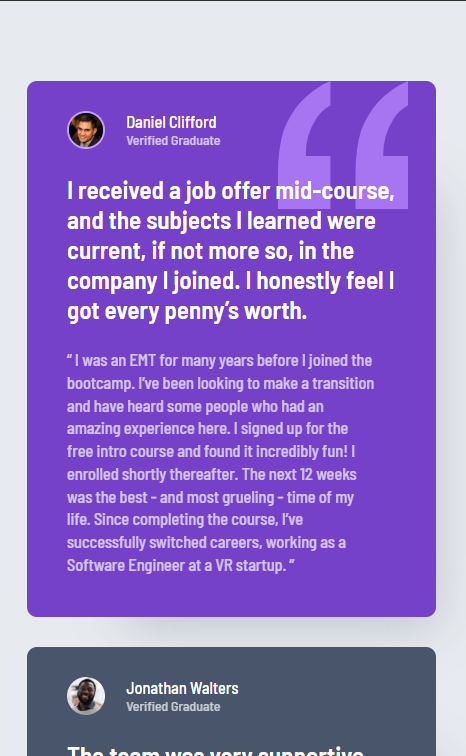
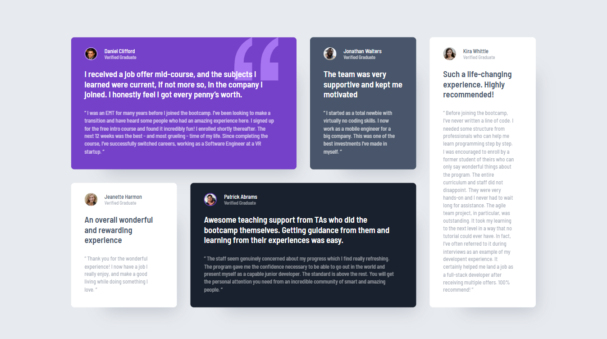
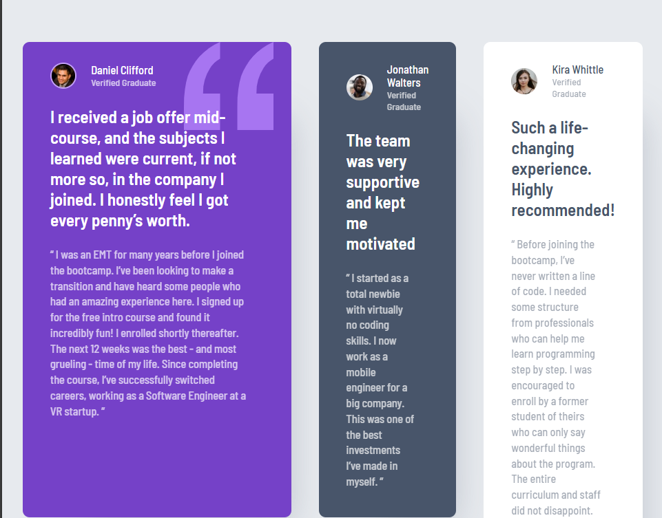

# Frontend Mentor - Testimonials grid section

## Welcome! 👋

Thanks for checking out this front-end coding challenge.

This is a solution to the [Testimonials grid section challenge on Frontend Mentor](https://www.frontendmentor.io/challenges/testimonials-grid-section-Nnw6J7Un7). Frontend Mentor challenges help me improve my coding skills by building realistic projects. 

## Table of contents

- [Overview](#overview)
  - [The challenge](#the-challenge)
  - [Screenshot](#screenshot)
  - [Links](#links)
- [My process](#my-process)
  - [Built with](#built-with)
  - [What I learned](#what-i-learned)
  - [Continued development](#continued-development)
  - [Useful resources](#useful-resources)
- [Author](#author)
- [Acknowledgments](#acknowledgments)

## Overview

### The challenge

Users should be able to:

- See hover and focus states for all interactive elements on the page

### Screenshot

### Links

- Solution URL: [Testimonials grid section's Github Page](https://github.com/irsalinalayalia/fe_mentor_testimonials_grid_section)
- Live Site URL: [Testimonials grid section's Live Site](https://irsalinalayalia.github.io/fe_mentor_testimonials_grid_section/)

## My process

### Built with
- Mobile-first workflow
- Semantic HTML5 markup
- CSS custom properties
- Flexbox
- Grid

### What I learned
Working on the Testimonials Grid Section project helped me strengthen several front-end development skills. Here’s what I gained from this experience:

✅ Responsive Grid Layouts: I learned how to effectively use CSS Grid to create a responsive layout that adapts well to different screen sizes, especially mobile and tablet views.

✅ Custom Fonts & Web Typography: I implemented custom fonts using @font-face and practiced consistent typography through CSS variables for font sizes and weights.

✅ CSS Variables for Design Tokens: I used CSS custom properties (variables) to manage colors, spacing, and typography, making the code more scalable and easier to maintain.

✅ Styling Components Based on Theme: I practiced applying different background and text colors to individual cards to match the design, using utility classes and modifiers.

✅ Image Positioning and Decorative Elements: I handled background images with precise positioning (like the quotation mark image) to match the given design specifications.

✅ Clean and Organized HTML/CSS Structure: I focused on semantic HTML and modular CSS structure for better readability and maintainability.

✅ Media Queries for Responsiveness: I improved my skills in using media queries to switch layout from a single-column (mobile) to a grid layout (tablet and up).

I also used a mobile-first approach when writing the CSS, and it really paid off. By starting with the smallest screen size and progressively enhancing the layout, I was able to ensure a fully responsive design that looks great on all devices — from mobile phones to large desktop screens.

### Useful resources

- [Jasoneczek's Profile on Front End Mentor](https://www.frontendmentor.io/profile/jasoneczek) - This profile helped me out to know the exact size of the card and padding because my FE Mentor Member is not premium so I dont get the figma file and dont know the exact size and the Jasoneczek's profile helps me alot.

## Author

- Website - [Irsalina Layalia Shabrina](https://irsalinalayalia.vercel.app/)

- Frontend Mentor - [@irsalinalayalia](https://www.frontendmentor.io/profile/irsalinalayalia)

## Acknowledgments

Thanks to God who always help and accompanied me when working on this project
